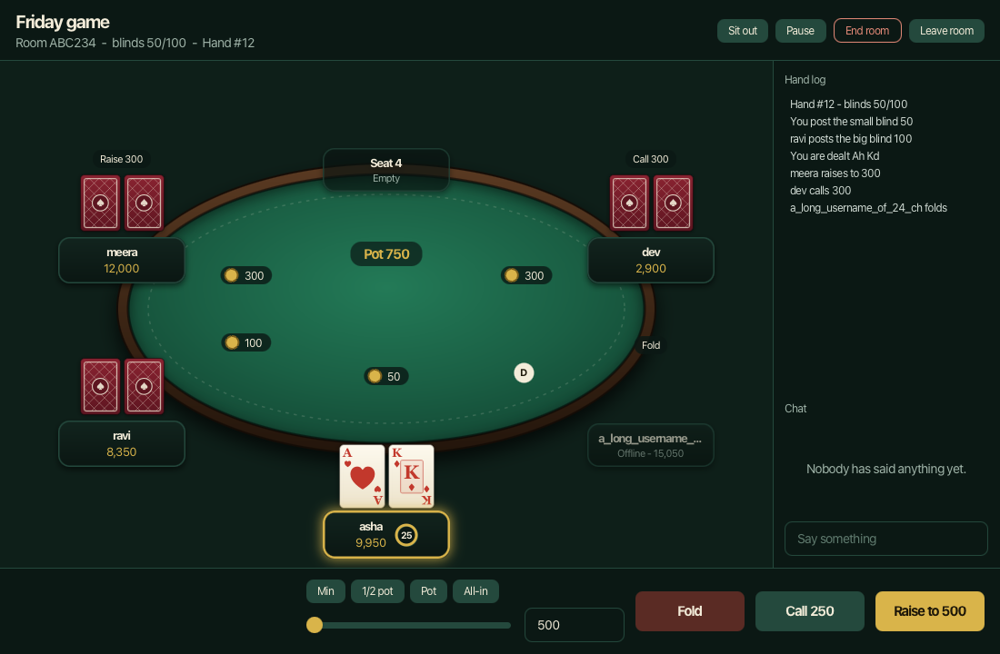
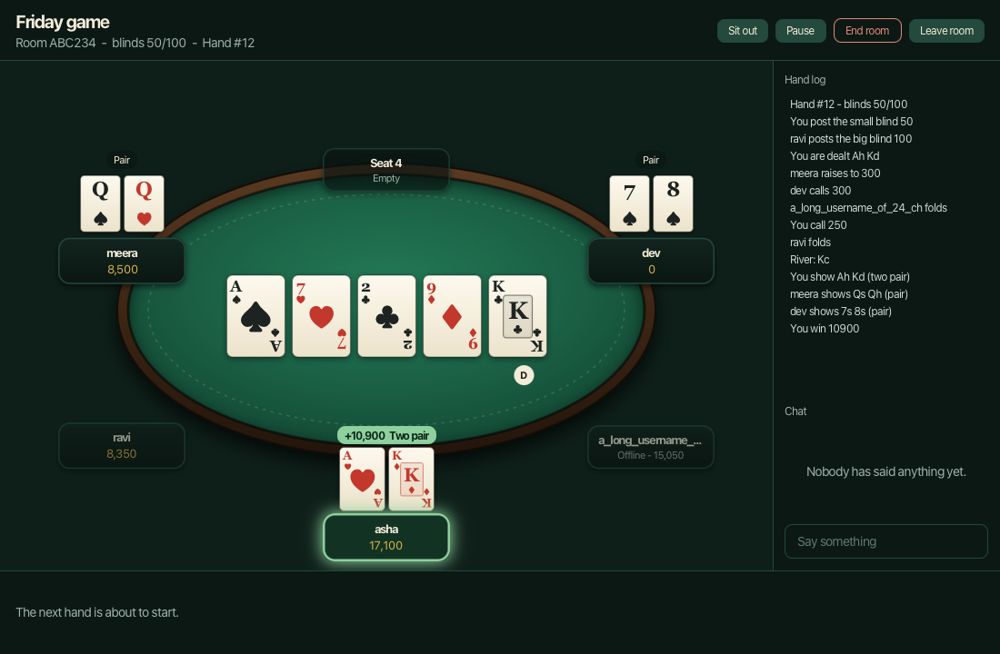
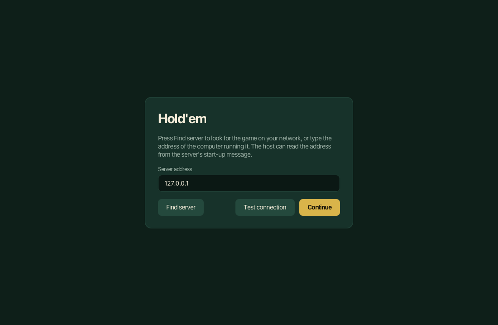
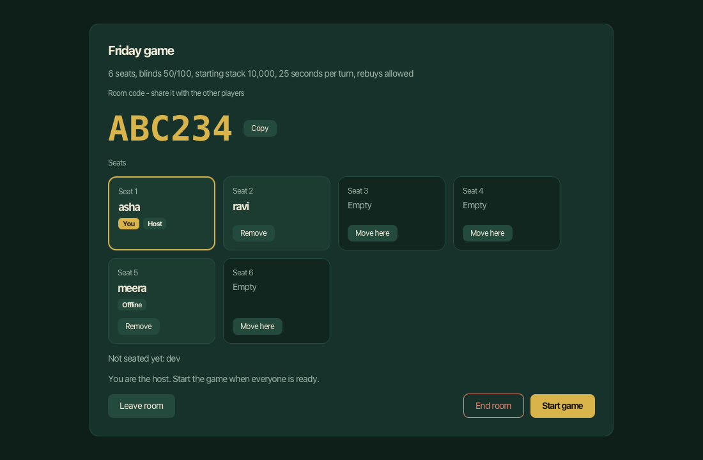
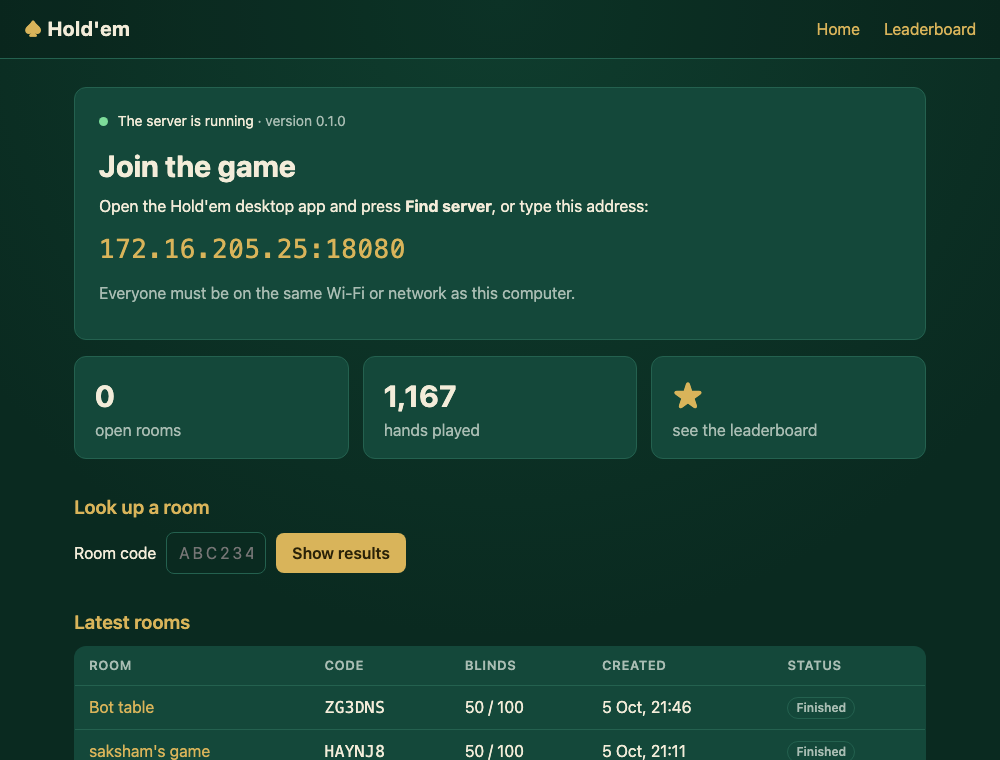
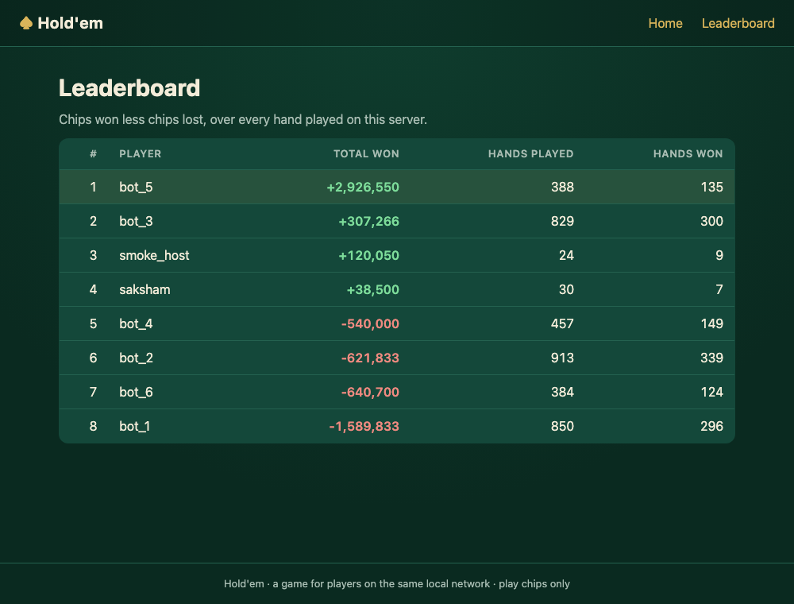
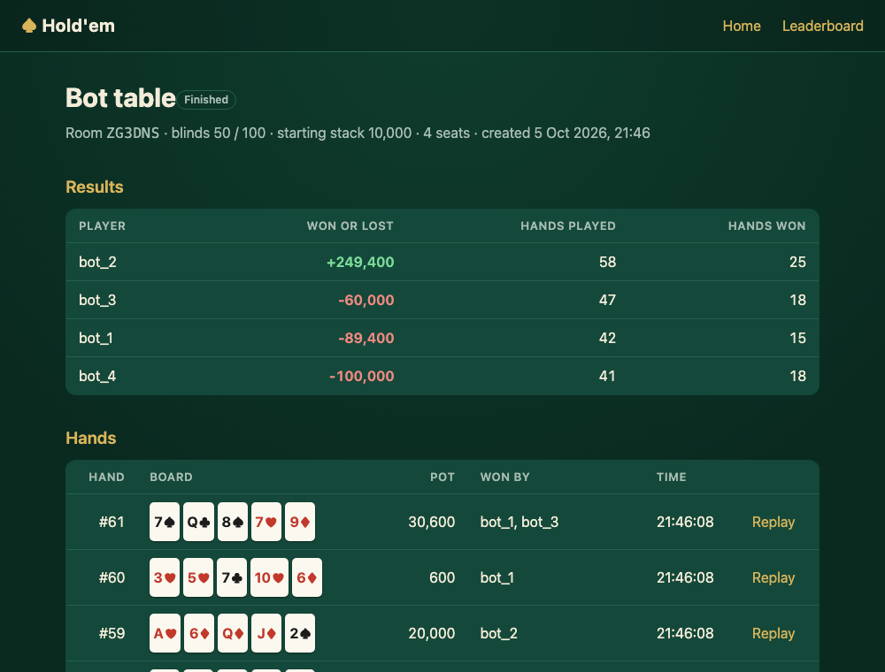
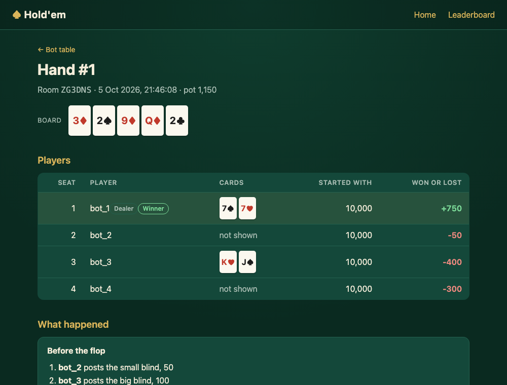

# Hold'em

No-Limit Texas Hold'em for players on the same Wi-Fi or LAN, written in Java.

One computer, the host machine, runs the server and the database. Everyone else runs the desktop
app, types the host machine's IP address, logs in, and creates a room or joins one with a
6-character code.

- What it must do: [docs/SPEC.md](docs/SPEC.md)
- Build order and progress: [docs/PLAN.md](docs/PLAN.md)

- Getting a group playing, step by step: [docs/LAN-SETUP.md](docs/LAN-SETUP.md)
- Hands-on checklist before a demo: [docs/QA.md](docs/QA.md)

**Status:** the game is complete (phases 0 to 8). Computer players are being added: the host can
seat easy and medium bots from the app (phases 9 and 10), and stronger ones are planned
(`docs/PLAN.md`). Still to do: testing by hand on several computers (`docs/QA.md`).

## What it looks like

The desktop app:

| | |
|---|---|
|  |  |
| Your turn: fold, call or raise, with the timer running on your seat | Showdown: hands are turned over one by one, then the winner is shown |
|  |  |
| **Find server** looks for the game on your network | The waiting room, with the code to read out |

The server's web pages, open to any browser on the network:

| | |
|---|---|
|  |  |
| The front page: the address to type, and the latest rooms | The leaderboard |
|  |  |
| A room's results and its hands | One hand, street by street |

## What it does

- **Play.** No-Limit Texas Hold'em for 2 to 9 players: blinds, betting, all-ins, side pots,
  showdown. Turn timers, sitting out, rebuys, chat, and host controls (start, pause, end).
- **Find each other.** The app searches the network for the server; a room is joined with a
  6-character code.
- **Recover.** A dropped connection reconnects by itself and puts the player back in their seat.
- **Look back.** Every hand is saved. The app has hand history, replays, export to a text file and
  a leaderboard; the server has the same as web pages.
- **Look good.** Cards are dealt, turned over and mucked with movement; chips fly to the pot.
  Four card backs, a four-colour deck, your own pictures for the cards, and sounds you can turn off.
- **Play alone.** The host presses **Add bot** to seat computer players, which know only what a
  person in their seat would see.
- **Test alone.** Separate network test bots join a room like people, for long unattended runs.

## Modules

| Module | What it is |
|---|---|
| `poker-common` | Cards, actions, protocol messages, error codes, exceptions |
| `poker-engine` | Pure Hold'em rules: betting, pots, hand evaluator. No I/O, no threads |
| `poker-ai` | Computer players: what a bot sees of a hand and how it chooses its action |
| `poker-server` | Runs on the host machine in Tomcat 10.1: JSON API, WebSocket game, rooms, JDBC, JSP pages |
| `poker-client-fx` | JavaFX desktop app |
| `poker-bot-client` | Headless test bots that join a room like a human |

## Setting up the host machine

You need:

- JDK 21 or newer
- Docker (for PostgreSQL), or a local PostgreSQL 16

Maven is not needed; the project brings its own (`./mvnw`, or `mvnw.cmd` on Windows).

```bash
docker compose up -d
```

`server.properties` is optional; without it the server uses defaults that match the Docker
database. To change the database address or password, copy the example and edit it:

```bash
cp server.properties.example server.properties
```

```bash
./mvnw -q clean verify
```

## Running

Start the server. It listens on port 8080 on every network interface; stop it with Ctrl+C.

```bash
./mvnw -pl poker-server -am -DskipTests package cargo:run
```

When it starts, the server prints the address players should use, for example
`Players can connect to: http://192.168.1.20:8080/poker`. The same lines go to
`data/logs/server.log`.

Open that address in a browser, from the host machine or any other device on the network, to see
the server's web pages: the leaderboard, each room's results, and a replay of every hand.

To check the API from a terminal:

```bash
curl http://127.0.0.1:8080/poker/api/ping
```

### Trying the API with curl

Register (the answer contains a `token`):

```bash
curl -X POST -H 'Content-Type: application/json' -d '{"username":"asha","password":"choose-a-password"}' http://127.0.0.1:8080/poker/api/auth/register
```

Create a room, putting your token in place of `TOKEN` (the answer contains the room `code`):

```bash
curl -X POST -H 'Content-Type: application/json' -H 'Authorization: Bearer TOKEN' -d '{"name":"Friday game","maxPlayers":6,"smallBlind":50,"bigBlind":100,"startingStack":10000,"turnSeconds":25,"rebuyAllowed":true}' http://127.0.0.1:8080/poker/api/rooms
```

Look the room up, putting its code in place of `ABC234`:

```bash
curl -H 'Authorization: Bearer TOKEN' http://127.0.0.1:8080/poker/api/rooms/ABC234
```

Start the desktop app:

```bash
./mvnw -pl poker-client-fx -am compile javafx:run
```

Press **Find server**, or type the server's address (`127.0.0.1` on the host machine itself), create
an account, then create a room. To fill the room, run the bots with its code:

```bash
./mvnw -pl poker-bot-client -am compile exec:java -Dexec.args="--server 127.0.0.1 --room ABC234 --bots 3 --hands 0"
```

The app keeps its settings and a remembered login in `~/.holdem`. Sounds can be turned off under
**Settings** on the home screen.

### Making the cards your own

**Settings** on the home screen lets you pick one of four card backs, switch to a four-colour deck
(clubs green, diamonds blue), or use your own picture as the card back: press "Use my own picture"
and choose a PNG or JPEG. A picture 5 wide by 7 tall fits best, such as 500 by 700 pixels.

To replace card faces as well, put pictures in `~/.holdem/cards/`, named by rank and suit: `Ah.png`
for the ace of hearts, `Td.png` for the ten of diamonds, `2c.png` for the two of clubs. Ranks are
`2 3 4 5 6 7 8 9 T J Q K A` and suits are `c d h s`. Any card without a picture keeps its drawn face,
so you can replace just the court cards or the whole deck.

To run a second server for testing while one is already running, give it its own ports:

```bash
./mvnw -pl poker-server -am -DskipTests package cargo:run -Dholdem.port=18080 -Dholdem.shutdown.port=18205 -Dholdem.ajp.port=18009
```

Then use `127.0.0.1:18080` as the server address.

## Watching bots play

With the server running, this makes six bots create a room and play 100 hands against each other,
over the same connection a person's app will use:

```bash
./mvnw -pl poker-bot-client -am compile exec:java -Dexec.args="--server 127.0.0.1 --bots 6"
```

It ends with a line such as `Finished: 6 bots played 104 hands in room ABC234 with no problems`.
At normal speed a hand takes a few seconds. For a fast run of hundreds of hands, start the server
with no waits between hands instead:

```bash
./mvnw -pl poker-server -am -DskipTests package cargo:run -Dholdem.config=$PWD/poker-bot-client/soak-server.properties
```

```bash
./mvnw -pl poker-bot-client -am compile exec:java -Dexec.args="--server 127.0.0.1 --bots 6 --hands 500 --think 0"
```

Add `--room ABC234` to make the bots join a room you are hosting instead of creating their own.
Bots pause for a second or two before each action, a little longer before a bet or raise, so you
can follow what they do; `--think 300-900` changes the range (in milliseconds) and `--think 0`
makes them act at once.
The bots use accounts named `bot_1` to `bot_9`, which they register the first time.

## Measuring the bots

The arena plays bots against each other with no server, about 100,000 hands a second, and prints
who won in big blinds per 100 hands:

```bash
./mvnw -q -pl poker-ai -am compile exec:java -Dexec.args="--hands 200000 --bots easy,easy,solid,solid,simulation,simulation"
```

`easy` and `simulation` are the Easy and Medium bots in the app; `solid` is the rule-based bot
without its beginner's habits; `caller` never folds. The `+/-` column is the margin of error: a
difference smaller than it could be luck. `--seed 7` replays the same cards.

## Where hands are kept

Every finished hand is saved in three places, all under `data/` on the host machine:

| Where | What |
|---|---|
| The database | Each hand with its players and actions, for history, replays and the leaderboard |
| `data/hand-history/room-<code>/<date>.txt` | A text file anyone can read, one per room per day. It shows only what was public at the table |
| `data/failed-hands/` | Normally empty. If the database is down, hands are written here as JSON instead of being lost |

The server log is `data/logs/server.log`.

## Giving the app to other players

```bash
./mvnw -pl poker-client-fx -am -DskipTests package
```

This builds `poker-client-fx/target/holdem-client`. Copy that whole folder to the other PC, which
needs only Java 21 or newer:

- Windows: double-click `run.bat`
- macOS or Linux: `sh run.sh`

[docs/LAN-SETUP.md](docs/LAN-SETUP.md) has the whole walk-through, including the firewall.

## Watching the engine play a hand

Prints one hand between six random players:

```bash
./mvnw -q -pl poker-engine -am test-compile
```

```bash
java -cp poker-common/target/classes:poker-engine/target/classes:poker-engine/target/test-classes com.saksham.poker.engine.hand.EngineConsoleDemo
```

## Tests

```bash
./mvnw -q clean verify
```

Tests that need the database or measure speed are tagged `db` and `perf` and skipped by default.
To run them too, with the Docker database running:

```bash
./mvnw verify -DexcludedTags=
```

## Where each Java concept is

The project was written to show these parts of the language. Each row names real classes to open.

| Concept | Where to look |
|---|---|
| Packages | Five modules, each split by job: `common.card`, `common.protocol`, `engine.hand`, `engine.pot`, `server.room`, `server.db`, `server.web`, `client.view`, `client.net` and so on |
| Abstract classes | `PlayerAction`, `GameEvent`, `Message`, `RoomCommand`, `SeatController`, `PokerException`, `BaseDao`, `BaseServlet`, `PageServlet` |
| Inheritance | `Fold`/`Check`/`Call`/`Bet`/`Raise` extend `PlayerAction`; `UserDao`/`RoomDao`/`HandDao` extend `BaseDao`; `LoginServlet` and the other API servlets extend `BaseServlet`; `HomeServlet`, `LeaderboardServlet`, `RoomResultsServlet`, `HandReplayServlet` extend `PageServlet` |
| Polymorphism | A room runs any `RoomCommand` with `command.execute(room)`; it talks to a player only through `SeatController`; `PageServlet.doGet` calls each page's own `prepare`; JSON messages are read back as the right subclass of `Message` |
| User-defined exceptions | `PokerException` and its tree: `GameRuleException` (`NotYourTurnException`, `InvalidActionException`, `InvalidAmountException`), `RoomException` (`RoomNotFoundException`, `RoomFullException`, ...), `AuthException`, `ProtocolException`; unchecked `PersistenceException` and `StorageException`. Each carries an `ErrorCode` |
| File handling | `HandHistoryFileWriter` (text hand histories), `HandRecordWriter` (JSON files for hands the database refused), `ServerConfig` (`server.properties`), `MigrationRunner` (SQL files); in the app `AppConfig`, `SessionStore`, `HandHistoryExporter`, `CardArt` (your own card pictures) |
| Collections | `ArrayList` deck with `Collections.shuffle`, `EnumMap` in `HandEvaluator` and `SoundPlayer`, `ArrayDeque` for the order of action, `ConcurrentHashMap` of rooms and connections, `LinkedBlockingQueue` of room commands, `LinkedHashSet` of servers found, JavaFX `ObservableList` |
| JavaFX | Everything under `client.view`: `TableView`, `TableSurface`, `SeatNode`, `CardNode`, `ActionPanel`, with movement timed in `Motion` and state held as properties in `RoomState` |
| JDBC | `DataSourceProvider` (connection pool), `BaseDao` (`PreparedStatement` everywhere, transactions), `UserDao`, `RoomDao`, `HandDao`, `AuthTokenDao`, `MigrationRunner` |
| Servlets | The JSON API under `/api/*` (`RegisterServlet`, `RoomsServlet`, `HandsServlet`, ...), the page controllers, the filters `AuthFilter` and `CharsetFilter`, and the start-up listener `AppContextListener` |
| JSP | `WEB-INF/views`: `home.jsp`, `leaderboard.jsp`, `room-results.jsp`, `hand-replay.jsp`, `error.jsp`, with a shared `header.jspf` and `footer.jspf`, JSTL and EL only, and two tag files (`cards.tag`, `net.tag`) |
| Multithreading | One `RoomActor` thread per room fed by a queue; `HandRecordWriter` (producer and consumer); a sender thread per `Connection`; `DiscoveryResponder` (UDP thread); in the app the network threads hand results to the screen with `Platform.runLater`, and `SoundPlayer` and `ServerDiscovery` have threads of their own; the bots run many players at once |
